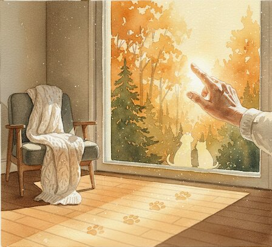
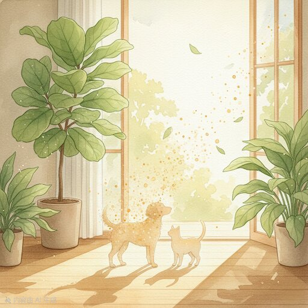
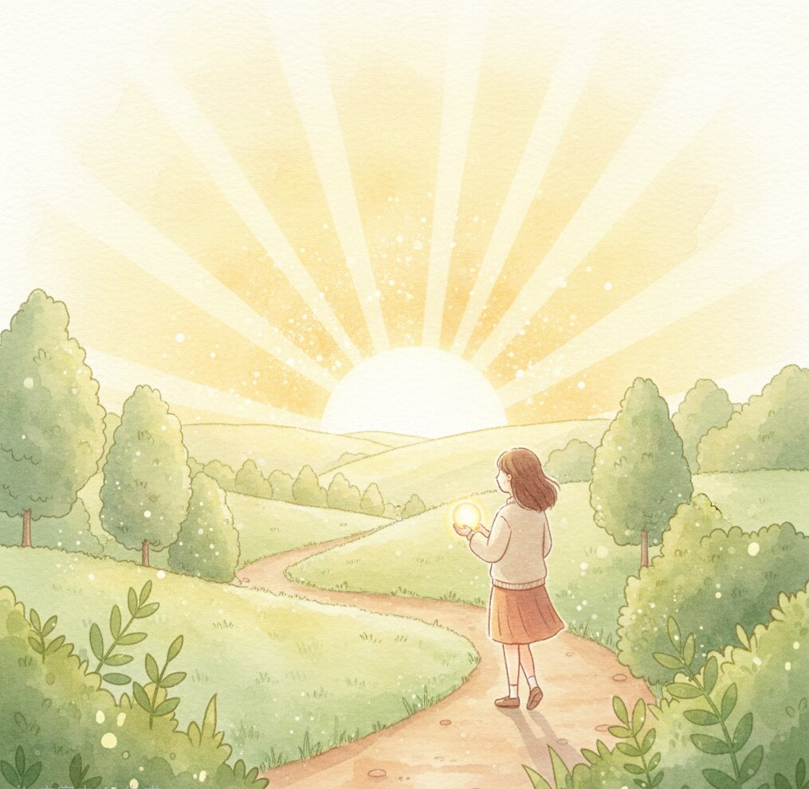

<!DOCTYPE html>
<html lang="en">
<head>
<meta charset="UTF-8">
<meta name="viewport" content="width=device-width, initial-scale=1.0">
<title>That Gentle Door | Finding Peace After Pet Loss | Mivimika Lu</title>
<meta name="description" content="A compassionate guide for anyone navigating pet loss and grief. That Gentle Door by Mivimika Lu — featured on the APLB Recommended Reading List.">
<meta name="keywords" content="pet loss book, pet grief, pet bereavement, losing a pet, dog loss, cat loss, pet death grief, pet loss support, rainbow bridge, euthanasia guilt, pet loss guide, grief after pet death">

<link rel="preconnect" href="https://fonts.googleapis.com">
<link rel="preconnect" href="https://fonts.gstatic.com" crossorigin>
<link href="https://fonts.googleapis.com/css2?family=Cormorant+Garamond:ital,wght@0,300;0,400;1,300;1,400&family=Jost:wght@300;400;500&display=swap" rel="stylesheet">

</head>
<body>

<!-- NAV -->
<nav id="nav">
  <a href="#" class="nav-logo">That Gentle Door</a>
  <ul class="nav-links">
    <li><a href="#about">The Book</a></li>
    <li><a href="#readers">Reader Stories</a></li>
    <li><a href="#buy">Order Now</a></li>
    <li><a href="https://www.tiktok.com/@lovemivi_" target="_blank">TikTok</a></li>
    <li><a href="https://substack.com/@mivimikalu/posts" target="_blank">Substack</a></li>
  </ul>
</nav>

<!-- HERO -->
<section class="hero">
  

    <!-- 图片名称：hero.jpg → 用你的 1000035053.png 改名为 hero.jpg -->
    
  

  

    ✦ APLB Recommended Reading List
    <h1><em>That Gentle</em> Door</h1>
    
Understanding Pet Loss, Love, and Life After Goodbye

    
Mivimika Lu

    <a href="https://www.amazon.com/That-Gentle-Door-Understanding-Goodbye/dp/B0GJNFJV7S" target="_blank" class="btn-main">Buy on Amazon US</a>
    <a href="https://www.amazon.co.uk/That-Gentle-Door-Understanding-Goodbye/dp/B0GJNFJV7S" target="_blank" class="btn-ghost">Amazon UK</a>
  

</section>

<!-- INTRO -->
<section class="intro-section" id="about">
  

    <h2>When they cross that gentle door, where do they go?</h2>
    
If you're holding this page, you may be grieving the loss of a beloved pet. The leash still hangs by the door. The bowl sits untouched. And the question that echoes through your days is one no one seems able to answer.

    
That Gentle Door is a compassionate, thoughtful guide for anyone navigating pet loss, animal grief, or the death of a beloved companion. Unlike many pet loss books that rely on clichés or quick reassurances, this book respects both your intelligence and your pain.

    <blockquote class="verse">
      "Energy cannot be destroyed. This is not metaphor — this is physics. 
      The warmth that once lived in their body is still here. 
      Not in the same form. But here."
    </blockquote>
    
Written with the tenderness of poetry and grounded in science, psychology, philosophy, and spirituality.

  

  

    <!-- 图片名称：book.jpg → 用你的 1000033478.jpg 改名为 book.jpg -->
    
  

</section>

<!-- WHAT'S INSIDE -->
<section class="inside-section">
  
Inside This Book

  <h2>This book <em>answers</em> the questions that truly matter</h2>
  

    

      
01

      <h3>Why do I feel so guilty after my pet died?</h3>
      
Learn how sudden loss, euthanasia decisions, and accidents affect the grieving brain — and why guilt is not proof of failure, but evidence of love.

    

    

      
02

      <h3>Was my pet's life too short?</h3>
      
Discover a powerful reframing of "short" lives as complete lives, helping release regret and self-blame.

    

    

      
03

      <h3>Where do pets go after death?</h3>
      
Explore multiple perspectives — the Rainbow Bridge, energy conservation, and continued presence — offered gently, without demanding belief.

    

    

      
04

      <h3>How do I keep living after losing my pet?</h3>
      
Find guidance on moving forward with love, not "moving on," and honoring your bond while continuing life.

    

  

  
This Book Integrates

  

    

      🧠
      <h4>Neuroscience</h4>
      
Why grief feels physically unbearable

    

    

      💭
      <h4>Psychology</h4>
      
How attachment and loss affect the mind

    

    

      ⚛️
      <h4>Physics</h4>
      
Energy conservation, explained simply

    

    

      🌿
      <h4>Philosophy</h4>
      
Stoicism, impermanence, and meaning

    

    

      ✨
      <h4>Spirituality</h4>
      
The Rainbow Bridge, as one possible comfort

    

  

</section>

<!-- ENDORSEMENT -->
<section class="endorse-section">
  

    
Expert Endorsement

    <blockquote class="endorse-quote">
      "This book doesn't promise a cure for your heartache. Instead, it offers companionship through the wilderness."
    </blockquote>
    

      

        📖
        Featured on the Association for Pet Loss and Bereavement's Recommended Reading List
      

      

        ✦
        Highly recommended by APLB-Certified Pet Loss Grief Counselor
      

    

  

  

    <!-- 图片名称：endorse.jpg → 用你的 1000035049.png 改名为 endorse.jpg -->
    
  

</section>

<!-- REVIEWS -->
<section class="reviews-section" id="readers">
  

    

      
Reader Stories

      <h2>Words from those who have walked <em>this path</em></h2>
    

    
Real readers. Real grief. Real healing. Shared freely in pet loss communities — because sometimes, the most healing thing we can do is pass on what helped us.

  

  

    

      
★★★★★

      
"It has been very helpful. Easy to read and each time I read it I feel a little better."

      
Facebook Community

    

    

      
★★★★★

      
"I read it in one sitting, bawling my eyes out. That book, and God, helped me more than you could ever know."

      
Facebook Community

    

    

      
★★★★★

      
"It's an easy 85-page book that has helped me so much. I wish I knew about it earlier. I will read it again and again. If you need comfort, I highly recommend it."

      
Facebook Community

    

    

      
★★★★★

      
"It gives you a more beautiful perspective of life. A part of me feels peace knowing he's at home again."

      
Facebook Community

    

    

      
★★★★★

      
"Incredible read, it helped a lot."

      
Facebook Community

    

    

      
★★★★★

      
"Helped me more than the writer could ever know. Made my perspective so much clearer and better."

      
Amazon UK · Verified Purchase

    

    

      
★★★★★

      
"This is such a powerful and beautiful book. I am so glad I was drawn to ordering this at a time of great loss."

      
Amazon UK · Verified Purchase

    

  

</section>

<!-- FOR YOU -->
<section class="foryou-section">
  

    <!-- 图片名称：foryou.jpg → 用你的 1000035052.png 改名为 foryou.jpg -->
    
  

  

    
This Book Is For You If

    <h2>You loved an animal with your <em>whole heart</em></h2>
    <ul class="foryou-list">
      <li>You are grieving the loss of a dog, cat, or other beloved pet</li>
      <li>You feel overwhelmed, numb, or like you are "losing your mind"</li>
      <li>You struggle with guilt, regret, or "what if" thoughts</li>
      <li>You want reassurance that your pet is not suffering</li>
      <li>You are unsure whether you can ever love another animal again</li>
      <li>You want a pet grief book that is thoughtful, intelligent, and emotionally honest</li>
      <li>"Just get another pet" is not an answer you can accept</li>
    </ul>
  

</section>

<!-- CTA -->
<section class="cta-section" id="buy">
  

    <!-- 图片名称：cta.jpg → 用你的 1000035048.png 改名为 cta.jpg -->
    
  

  

    <h2>"Your love was enough. It was always enough."</h2>
    
Available now in Kindle &amp; Paperback

    

      <a href="https://www.amazon.com/That-Gentle-Door-Understanding-Goodbye/dp/B0GJNFJV7S" target="_blank" class="btn-main">Buy on Amazon US</a>
      <a href="https://www.amazon.co.uk/That-Gentle-Door-Understanding-Goodbye/dp/B0GJNFJV7S" target="_blank" class="btn-ghost">Amazon UK</a>
    

  

</section>

<!-- FOOTER -->
<footer>
  That Gentle Door · Mivimika Lu
  

    <a href="https://www.amazon.com/That-Gentle-Door-Understanding-Goodbye/dp/B0GJNFJV7S" target="_blank">Amazon US</a>
    <a href="https://www.amazon.co.uk/That-Gentle-Door-Understanding-Goodbye/dp/B0GJNFJV7S" target="_blank">Amazon UK</a>
    <a href="https://www.tiktok.com/@lovemivi_" target="_blank">TikTok</a> 
    <a href="https://substack.com/@mivimikalu/posts" target="_blank">Substack</a>
  

  
© 2026 Mivimika Lu · All rights reserved · Featured on the APLB Recommended Reading List

</footer>

</body>
</html>
